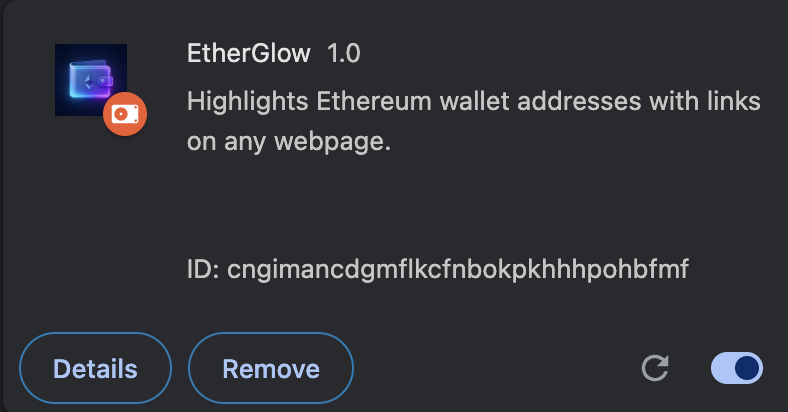

# 💫 EtherGlow



## Project Overview

EtherGlow is a lightweight Chrome extension that enhances Web3 browsing by automatically detecting Ethereum wallet addresses on any webpage and highlighting them with a vibrant, magical gradient glow.

Beyond just highlighting, EtherGlow transforms each address into a clickable link directing users to its detailed page on Etherscan for easy verification and exploration. It also enriches the user experience by resolving addresses to their respective ENS names when available, replacing complicated hexadecimal strings with user-friendly domain names.

## Installation

1. Clone this repository:

```
git clone https://github.com/tomasgrusz/wallet-glow.git
```

2. Install dependencies:

```
npm install
```

3. Create `.env` from `.env.example`, inputting your API keys.
```dotenv
INFURA_API_KEY="<INSERT_API_KEY>"
```

4. Build the project:

```
npm run build
```

5. Add extension to Chrome:
   > 1. Visit [Chrome Extensions](chrome://extensions/) in your browser.
   >
   > 2. Enable `Developer mode` in top left corner.
   >
   > 3. Click `Load unpacked` with the folder containing this project
   >
   > 4. Enable imported extension
